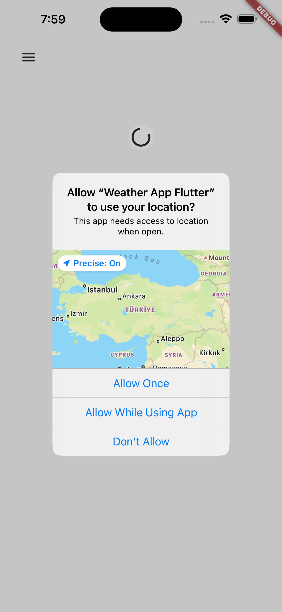

# Weather App Flutter
## Description

This is a simple weather app made with Flutter and Dart. It uses the OpenWeatherMap API to get the weather data. 

## Features

- Get the weather data of your current location
- Get the weather data of a random city in the world

## Technologies

- Flutter
- Dart
- OpenWeatherMap API
- **Dio** (HTTP Client)
- **Provider** (State Management)
- Geolocator (Location)
- Geocoding (Reverse Geocoding)

## Screenshots

| Location Request | Weather Screen | Weather Screen |
| :---: | :---: | :---: |
 |  |  |

## To Do

- [ ] Add a search bar to search for a specific city
- [ ] Add a settings page to change the temperature unit
- [ ] Add a settings page to change the language
- [ ] Change the theme according to the weather
- [ ] Add a loading screen
- [ ] Add a splash screen
- [ ] Add a drawer to navigate between the locations
- [ ] Add animations
- [ ] and more...

## Getting Started

### Dependencies

* Flutter
* Dart

### Installing

* Clone the repository
* Run `flutter pub get` to install the dependencies
* Run `flutter run` to run the app

## License

This project is licensed under the MIT License - see the LICENSE.md file for details

## Acknowledgments

* [OpenWeatherMap API](https://openweathermap.org/api)
* [Flutter](https://flutter.dev/)
* [Dart](https://dart.dev/)
